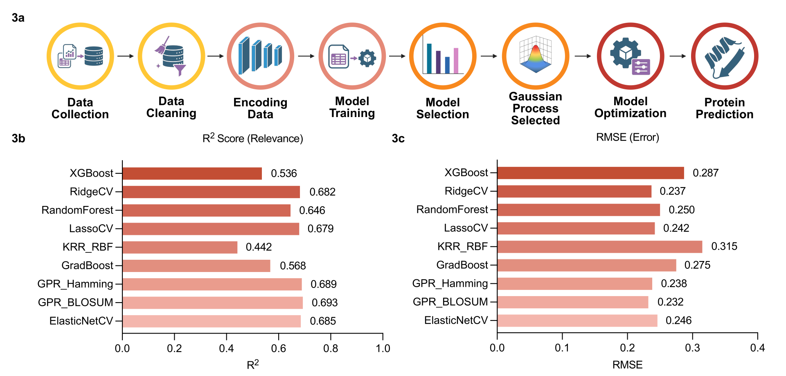
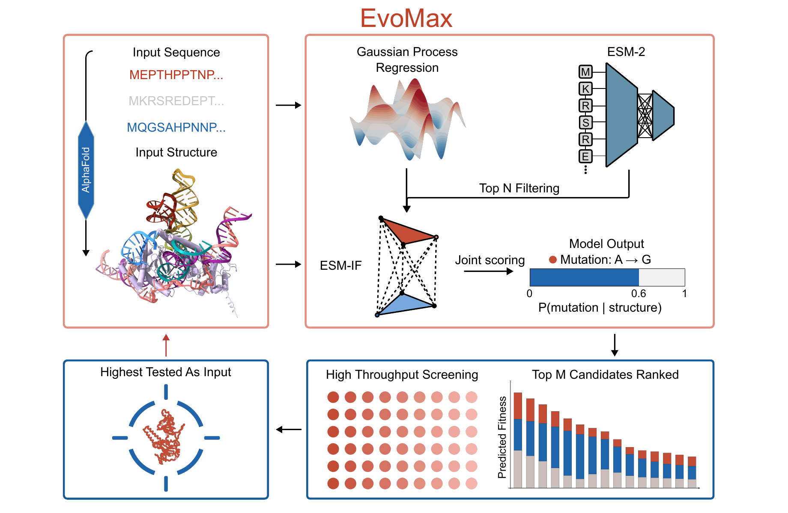

<div align="center">

# EvoMax
### *Adaptive model-guided protein evolution with sparse data optimizes compact eukaryotic genome editors*

[](#runtime)
[](#model-specifications)
[](https://github.com/Jackson-Gold/EvoMax/actions/workflows/smoke-test.yml)
[](LICENSE)

**EvoMax** is a data-efficient mutation-ranking framework that integrates **ESM-2**, **ESM-IF**, and **Gaussian Process Regression with BLOSUM-based similarity features** to prioritize **single-site protein variants** from sparse experimental data, sequence, and structure.

</div>

---

## System Requirements

> **Full model inference requires a Linux machine with an NVIDIA GPU and CUDA.** The fixture-based smoke test uses precomputed scores and runs without a GPU.

| Requirement | Details |
|---|---|
| **OS** | Linux for full inference; any Docker-compatible host for the smoke test |
| **GPU** | CUDA-compatible NVIDIA GPU for full inference only |
| **CUDA** | 12.4 |
| **Python** | 3.11 |

The Dockerfile provides a lightweight, fixture-tested smoke target and a separate CUDA target for full model inference. See [`DOCKER_SETUP.md`](DOCKER_SETUP.md) for build and run instructions.

---

## Overview

EvoMax is a two-stage computational pipeline for exhaustive **single-amino-acid substitution** screening. The framework first performs broad, high-throughput prioritization using **GPR** and **ESM-2**, and then refines the top candidates using **ESM-IF** conditioned on the supplied protein structure. Final rankings are generated through robust score normalization and weighted aggregation. Each scoring stage can also consume a precomputed CSV override for smoke testing or score reuse.

This repository accompanies the manuscript accepted in principle at Nature Biotechnology.

### Project attribution

**[Shijie Wan](https://github.com/sw152)** is the first author. The project was conceived by Shijie Wan and Xue Sherry Gao. EvoMax construction and predictions were carried out by Shijie Wan, [Jackson Gold](https://github.com/Jackson-Gold), [Pranay Vure](https://github.com/pvure), and Casey S. Mogilevsky in the Xue Sherry Gao Laboratory at the University of Pennsylvania.

---

## Abstract

EvoMax is a data-efficient framework for rapid protein-function optimization from sparse experimental data. It integrates iterative experimental profiling with model-guided prioritization based on Gaussian process regression, protein language modeling, and inverse folding, enabling efficient navigation of complex sequence-to-fitness landscapes.

---

## Benchmarking and Architecture

<p align="center">
  
</p>

<p align="center"><sub><b>Manuscript Figure 3a-e.</b> EvoMax data pipeline, model benchmarking, ESM-2 mutation landscape, and fitness-space visualization.</sub></p>

---

## Table of Contents

- [System Requirements](#system-requirements)
- [Runtime](#runtime)
- [Inputs](#inputs)
- [Required Configuration](#required-configuration)
- [Pipeline Logic](#pipeline-logic)
- [Outputs](#outputs)
- [Configuration Details](#configuration-details)
- [Model Specifications](#model-specifications)
- [Reproducibility](#reproducibility)
- [Citation](#citation)

---

## Runtime

| Mode | Runtime considerations |
|---|---|
| Fixture smoke test | Uses precomputed CSV scores; no GPU or model download is required |
| Full model inference | Requires an NVIDIA GPU; runtime varies with sequence length, `top_k_mid`, GPU model, and whether model weights are cached |

A hardware-specific benchmark will be reported only with the protein length, GPU model, candidate count, and cache state specified.

---

## Inputs

For full inference, mount the required model and structure inputs in **`/data`** and provide their paths in the JSON configuration.

| Input | File / Type | Description |
|---|---|---|
| Wild-type sequence | JSON string | Canonical amino-acid sequence supplied as `wt_sequence` |
| Target structure | `.pdb` | Protein structure file (example: `/data/v2.pdb`) |
| GPR model | `GPR_BLOSUM.joblib` | Pre-trained Gaussian Process Regression model |
| Model cache | directory | Optional persistent Hugging Face and PyTorch caches for ESM-2 and ESM-IF weights |

The ESM-2 and ESM-IF models are loaded internally. Alternatively, any scoring stage can use a precomputed CSV by setting `use_gpr_csv`, `use_esm2_csv`, or `use_esmiF_csv` and the corresponding CSV path. The bundled smoke test enables all three overrides and therefore does not perform model inference.

---

## Required Configuration

Set the following values before execution:

| Parameter | Description | Example / Default |
|---|---|---|
| `wt_sequence` | Full wild-type amino acid sequence | user-specified |
| `pdb_path` | Path to structure file | `/data/my_structure.pdb` |
| `pdb_chain_id` | Chain identifier to analyze | `"A"` |
| `gpr_model_path` | Path to the serialized GPR model | `/data/GPR_BLOSUM.joblib` |
| `device_mode` | Device selection for model inference | `"auto"` |
| `top_k_mid` | Number of Stage 1 candidates passed to structural refinement | `100` |
| `normalization` | Score-scaling method used throughout the pipeline | `"robust_median_iqr"` |

---

## Pipeline Logic

### 1. Exhaustive Mutation Enumeration
All possible single-site substitutions are generated for the supplied wild-type sequence:

$$L \times 19$$

where $L$ denotes sequence length and 19 corresponds to all non-wild-type amino acid substitutions at each residue position.

### 2. Stage 1 — Screening
Every enumerated mutant is scored using:

- **GPR**
- **ESM-2**

These scores are combined to generate an initial ranking and to identify candidates that advance to structural refinement.

### 3. Stage 2 — Structural Refinement
The top-ranked Stage 1 candidates are rescored using **ESM-IF**, conditioned on the supplied protein backbone and selected chain.

### 4. Final Ranking
All relevant scores are normalized with:

- `robust_median_iqr`

The normalized scores are then weighted and aggregated into the final mutation ranking.

> **Scope note**
> This repository exposes **Round 3 only** (the final iteration). Intermediate Rounds 1 and 2 are not executed in this release.

---

## Outputs

All outputs are written to **`/results`**.

| File | Description |
|---|---|
| `all_single_mutants.csv` | Exhaustive list of all enumerated single-site mutations |
| `gpr_all.csv` | GPR scores for all mutants |
| `esm2_all.csv` | ESM-2 scores generated by the model or supplied as a CSV override |
| `stage1_top{K}.csv` | Top candidates selected after Stage 1 |
| `esmIF_top{K}.csv` | ESM-IF scores for Stage 2 candidates |
| `EvoMax_final_top{K}.csv` | **Final ranked mutation set** |

---

## Configuration Details

### Stage 1 Filtering

| Parameter | Default | Description |
|---|---:|---|
| `top_k_mid` | `100` | Number of candidates advanced to Stage 2 |
| `top_k_final` | `100` | Number of final ranked mutations returned |

### Scoring Weights

| Parameter | Default | Description |
|---|---:|---|
| `w_gpr_s1` | `0.35` | GPR contribution during Stage 1 |
| `w_esm2_s1` | `0.65` | ESM-2 contribution during Stage 1 |
| `w_gpr_final` | `0.05` | GPR contribution in final scoring |
| `w_esm2_final` | `0.70` | ESM-2 contribution in final scoring |
| `w_esmiF_final` | `0.25` | ESM-IF contribution in final scoring |

### Normalization

All scores are normalized with:

- `robust_median_iqr` — robust median and interquartile-range scaling

Other supported methods:

- `zscore`
- `rank_percentile`

---

## Model Specifications

| Component | Model | Description |
|---|---|---|
| Evolutionary model | `esm2_t33_650M_UR50D` | 650M-parameter masked language model |
| Structural model | `esm_if1_gvp4_t16_142M_UR50` | 142M-parameter inverse folding model loaded internally |

---

## Graphical Abstract

<p align="center">
  
</p>

<p align="center"><sub><b>Manuscript Figure 3f.</b> Compact graphical summary of the EvoMax workflow integrating sequence input, structure input, GPR, ESM-2, and ESM-IF for iterative high-throughput screening and final mutation ranking.</sub></p>

---

## Reproducibility

### Fixture smoke test

The automated smoke test uses fixed CSV fixtures for GPR, ESM-2, and ESM-IF. It validates configuration parsing, mutation enumeration, score normalization and aggregation, ranking, and output schemas. **It is not a GPR, ESM-2, or ESM-IF model-inference test.** The same fixture test runs during the default Docker image build and in GitHub Actions.

### Full pipeline

- Package and model versions are pinned in `environment.yml` and the Docker requirements files.
- GPR, ESM-2, and ESM-IF are fixed, pre-trained models; the runner performs no training or random sampling.
- ESM-2 and ESM-IF run in evaluation mode with gradient calculation disabled.
- The default normalization is `robust_median_iqr`.
- Small floating-point differences may occur across GPU models, CUDA versions, or PyTorch builds.

Full inference is intentionally separate from the CPU smoke test because it requires an NVIDIA GPU, model downloads, a target structure, and the study-specific serialized GPR model.

The manual [GPU image build workflow](https://github.com/Jackson-Gold/EvoMax/actions/workflows/gpu-image-build.yml) validates the pinned CUDA environment and all full-pipeline imports without claiming end-to-end model-inference coverage.

---

## Citation

If you use EvoMax, please cite the accompanying paper:

```bibtex
@article{evomax2026,
  title   = {Adaptive model-guided protein evolution with sparse data optimizes compact eukaryotic genome editors},
  author  = {Wan, Shijie and Gold, Jackson and Vure, Pranay and Mogilevsky, Casey S. and Talikoti, Ananya and Chen, Tianrong and Gupta, Aman and Biswas, Trisha and You, Zheng and Acharya, Vir and Chatterjee, Pranam and Wang, Xiao and Gao, Xue},
  year    = {2026},
  note    = {Accepted in principle at Nature Biotechnology}
}
```

The archived software record is available through the [Zenodo concept DOI](https://doi.org/10.5281/zenodo.21083837).

---

## License

This software is released under the [University of Pennsylvania Non-Commercial License](LICENSE). For commercial licensing inquiries, contact the [Penn Center for Innovation](https://www.upenn.edu/research/centers/penn-center-for-innovation) at 215-898-9591.

---

## Contact

For questions regarding the pipeline, manuscript, or reproducibility package, please [open an issue](https://github.com/Jackson-Gold/EvoMax/issues) or contact the corresponding author listed in the paper.
