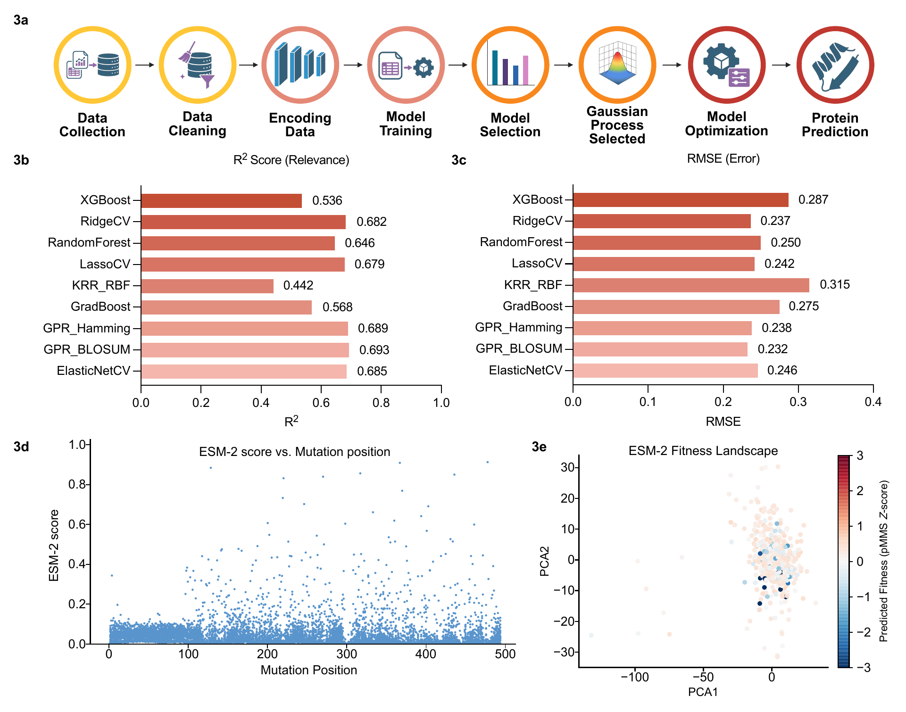
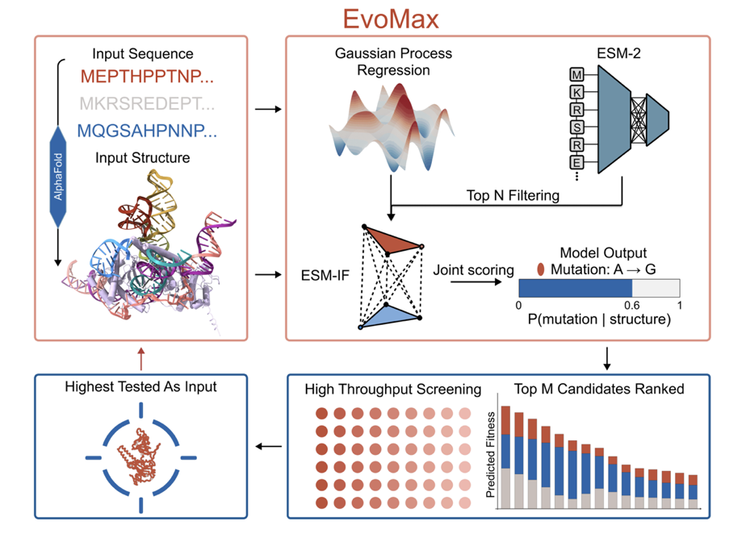

<div align="center">

# EvoMax
### *Adaptive Model-Guided Evolution of Compact Eukaryotic Nucleases Enables Efficient Genome Editing*

[](#runtime)
[](#model-specifications)
[](LICENSE)

**EvoMax** is a deterministic mutation-ranking framework that integrates **ESM-2**, **ESM-IF**, and **Gaussian Process Regression with BLOSUM-based similarity features** to prioritize **single-site protein variants** from sequence and structure.

</div>

---

## System Requirements

> **This pipeline requires a Linux machine with an NVIDIA GPU and CUDA.** It has been tested on Linux with CUDA 12.4. CPU-only execution is not supported for the full pipeline.

| Requirement | Details |
|---|---|
| **OS** | Linux |
| **GPU** | NVIDIA GPU (CUDA-compatible) |
| **CUDA** | 12.4+ recommended |
| **Python** | 3.11 |

A **Docker image** is also provided for reproducible execution. See [`DOCKER_SETUP.md`](DOCKER_SETUP.md) for build and run instructions.

---

## Overview

EvoMax is a two-stage computational pipeline for exhaustive **single-amino-acid substitution** screening. The framework first performs broad, high-throughput prioritization using **GPR** and **precomputed ESM-2** scores, and then refines the top candidates using **ESM-IF** conditioned on the supplied protein structure. Final rankings are generated through robust score normalization and weighted aggregation.

This repository accompanies the manuscript currently under review.

---

## Abstract

EvoMax is a data-efficient framework for rapid optimization of protein function with low experimental data. EvoMax integrates iterative experimental profiling with model-guided prioritization based on Gaussian process regression, protein language modeling, and inverse folding, enabling efficient navigation of complex sequence-to-fitness landscapes.

---

## Benchmarking and Architecture

<p align="center">
  
</p>

<p align="center"><sub><b>Figure 1.</b> Model-selection, benchmark, mutation-landscape, and PCA panels used to position EvoMax within the broader computational workflow.</sub></p>

---

## Table of Contents

- [System Requirements](#system-requirements)
- [Runtime](#runtime)
- [Inputs](#inputs)
- [Required Configuration](#required-configuration)
- [Pipeline Logic](#pipeline-logic)
- [Outputs](#outputs)
- [Configuration Details](#configuration-details)
- [Model Specifications](#model-specifications)
- [Reproducibility](#reproducibility)
- [Citation](#citation)

---

## Runtime

| Property | Value |
|---|---:|
| Expected runtime on a standard GPU | **~10 minutes** |
| GPU requirement | **Required** |
| Variability | Runtime may vary slightly with accelerator type and memory availability |

---

## Inputs

All required files are expected in the **`/data`** directory.

| Input | File / Type | Description |
|---|---|---|
| Target structure | `.pdb` | Protein structure file (example: `/data/v2.pdb`) |
| GPR model | `GPR_BLOSUM.joblib` | Pre-trained Gaussian Process Regression model |
| ESM-2 scores | `esm2_all.csv` | Precomputed ESM-2 mutation scores |

> **Note**
> The **ESM-IF** model is loaded internally by the pipeline and does not require a user-supplied model file.

---

## Required Configuration

Set the following values before execution:

| Parameter | Description | Example / Default |
|---|---|---|
| `wt_sequence` | Full wild-type amino acid sequence | user-specified |
| `pdb_path` | Path to structure file | `/data/my_structure.pdb` |
| `pdb_chain_id` | Chain identifier to analyze | `"A"` |
| `top_k_mid` | Number of Stage 1 candidates passed to structural refinement | `100` |
| `normalization` | Score-scaling method used throughout the pipeline | `"robust_median_iqr"` |

---

## Pipeline Logic

### 1. Exhaustive Mutation Enumeration
All possible single-site substitutions are generated for the supplied wild-type sequence:

$$L \times 19$$

where $L$ denotes sequence length and 19 corresponds to all non-wild-type amino acid substitutions at each residue position.

### 2. Stage 1 — Screening
Every enumerated mutant is scored using:

- **GPR**
- **Precomputed ESM-2**

These scores are combined to generate an initial ranking and to identify candidates that advance to structural refinement.

### 3. Stage 2 — Structural Refinement
The top-ranked Stage 1 candidates are rescored using **ESM-IF**, conditioned on the supplied protein backbone and selected chain.

### 4. Final Ranking
All relevant scores are normalized with:

- `robust_median_iqr`

The normalized scores are then weighted and aggregated into the final mutation ranking.

> **Scope note**
> This repository exposes **Round 3 only** (the final iteration). Intermediate Rounds 1 and 2 are not executed in this release.

---

## Outputs

All outputs are written to **`/results`**.

| File | Description |
|---|---|
| `all_single_mutants.csv` | Exhaustive list of all enumerated single-site mutations |
| `gpr_all.csv` | GPR scores for all mutants |
| `esm2_all.csv` | Precomputed ESM-2 scores |
| `stage1_top{K}.csv` | Top candidates selected after Stage 1 |
| `esmIF_top{K}.csv` | ESM-IF scores for Stage 2 candidates |
| `EvoMax_final_top{K}.csv` | **Final ranked mutation set** |

---

## Configuration Details

### Stage 1 Filtering

| Parameter | Default | Description |
|---|---:|---|
| `top_k_mid` | `100` | Number of candidates advanced to Stage 2 |
| `top_k_final` | `100` | Number of final ranked mutations returned |

### Scoring Weights

| Parameter | Default | Description |
|---|---:|---|
| `w_gpr_s1` | `0.35` | GPR contribution during Stage 1 |
| `w_esm2_s1` | `0.65` | ESM-2 contribution during Stage 1 |
| `w_gpr_final` | `0.10` | GPR contribution in final scoring |
| `w_esm2_final` | `0.20` | ESM-2 contribution in final scoring |
| `w_esmiF_final` | `0.70` | ESM-IF contribution in final scoring |

### Normalization

All scores are normalized with:

- `robust_median_iqr` — robust median and interquartile-range scaling

Other supported methods:

- `zscore`
- `rank_percentile`

---

## Model Specifications

| Component | Model | Description |
|---|---|---|
| Evolutionary model | `esm2_t33_650M_UR50D` | 650M-parameter masked language model |
| Structural model | `esm_if1_gvp4_t16_142M_UR50` | 142M-parameter inverse folding model loaded internally |

---

## Graphical Abstract

<p align="center">
  
</p>

<p align="center"><sub><b>Figure 2.</b> Compact graphical summary of the EvoMax workflow integrating sequence input, structure input, GPR, ESM-2, and ESM-IF for iterative high-throughput screening and final mutation ranking.</sub></p>

---

## Reproducibility

This pipeline is configured for deterministic execution and manuscript-level reproducibility.

- All models are fixed and pre-trained
- No stochastic training occurs during execution
- Random seeds are fixed
- All score normalization uses `robust_median_iqr`
- ESM-2 and ESM-IF scores are treated deterministically

---

## Citation

If you use EvoMax, please cite the accompanying paper:

```bibtex
@article{evomax2026,
  title   = {Adaptive Model-Guided Evolution of Compact Eukaryotic Nucleases Enables Efficient Genome Editing},
  author  = {Wan, Shijie and Gold, Jackson and Mogilevsky, Casey S. and Talikoti, Ananya and Chen, Tianrong and Gupta, Aman and Biswas, Trisha and You, Zheng and Acharya, Vir and Chatterjee, Pranam and Wang, Xiao and Gao, Xue},
  year    = {2026},
  note    = {Submitted}
}
```

---

## License

This software is released under the [University of Pennsylvania Non-Commercial License](LICENSE). For commercial licensing inquiries, contact the [Penn Center for Innovation](https://www.upenn.edu/research/centers/penn-center-for-innovation) at 215-898-9591.

---

## Contact

For questions regarding the pipeline, manuscript, or reproducibility package, please [open an issue](https://github.com/Jackson-Gold/EvoMax/issues) or contact the corresponding author listed in the paper.
